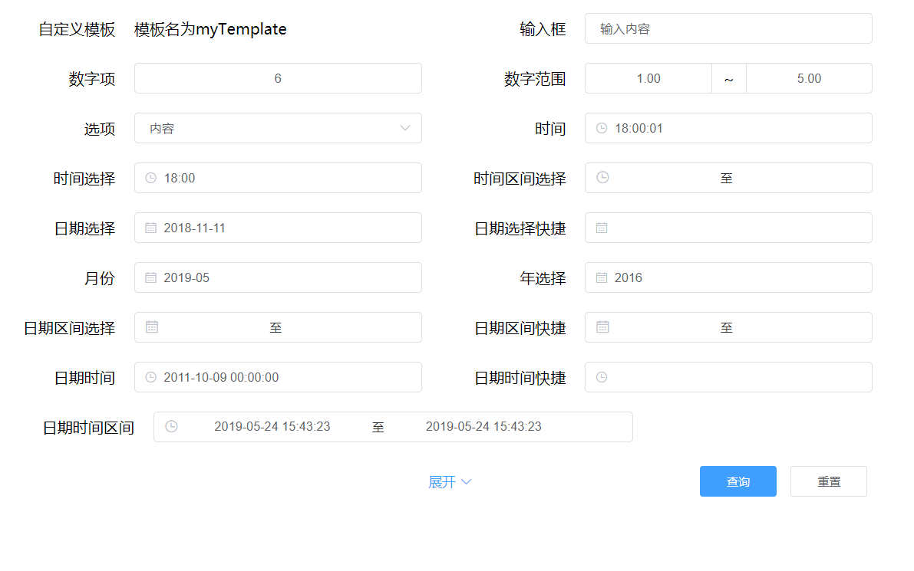
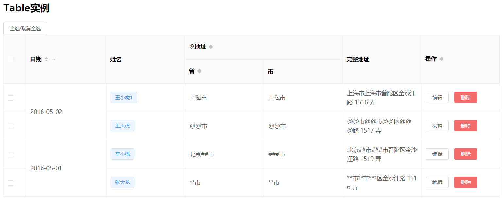

## 公共组件包说明

#### 简述：
本仓库公共组件包开发是基于ElementUI库搭建的，具体功能暂实现搜索面板的封装。

#### 实现目的
封装公共组件包是为了能更快实现功能页面的开发，减少大多数不必要的重复性代码，达到功能复用与加快开发速度的目的。

---

## 安装配置说明
#### 1. 安装依赖
首先需要项目安装依赖，运行命令：
```
npm install git+<ssh://gitxxx.git> --save-dev
```

#### 2. 包配置到项目中
找到Vue项目的创建的文件，编写配置代码

```vue
import Vue from 'vue'
import ElementPublicComponent from 'element-public-component'

Vue.use(ElementPublicComponent);
```

以上即可在任意页面开发中使用本公共UI库

若有需要获取最新包代码，只需要重新安装依赖即可。

---

## 功能案例

### （1）搜索面板组件

项目大多数页面都是基于搜索条件+表格内容展示，所以有必要把搜索条件封装成一个搜索面板，减少代码编写。

UI案例与代码使用可看下面叙述，若需要查看更详细搜索面板组件的配置，可点击[搜索面板的配置说明](./src/components/search-panel/README.md)。

#### UI案例：



#### 代码：

具体配置可看[搜索面板的详细配置说明](./src/components/search-panel/README.md)

```vue
<template>
  <div>
    <public-search-panel :config="config"
                width="300px"
                labelWidth="120px"
                padding="5px 15px"
                @formSubmit="onFormSubmit"
                @itemChange="onItemChange"
                @formReset="onFormReset">
      <template #myTemplate="{item}">
        <div>模板名为{{item.templateName}}</div>
      </template>
    </public-search-panel>
  </div>
</template>

<script>
  export default {
    name: "App",
    data() {
      return {
        config: [
          {
            label: '自定义模板',
            name: 'template',
            templateName: 'myTemplate',
          }, {
            label: '输入框',
            type: 'input',
            name: 'input',
            defaultValue: '输入内容'
          }, {
            label: '数字项',
            type: 'inputNumber',
            name: 'number',
            defaultValue: 6,
            customized: {
              min: -5,
              max: 10,
              step: 1,
            }
          }, {
            label: '数字范围',
            type: 'inputNumberRange',
            name: 'inputNumberRange',
            defaultValue: [1, 5],
            customized: {
              precision: 2,
              startPlaceholder: '请输入',
              endPlaceholder: '请输入'
            }
          }, {
            label: "选项",
            type: 'select',
            name: "select",
            defaultValue: 'content',
            customized: {
              options: [{
                label: '内容',
                value: 'content'
              }]
            }
          }, {
            label: '时间',
            type: 'time',
            name: "time",
            defaultValue: '18:00:01',
            customized: {
              selectableRange: '10:00:01 - 16:06:09'
            }
          }, {
            label: '时间选择',
            type: 'timeSelect',
            name: 'timeSelect',
            defaultValue: "18:00",
            customized: {
              start: '09:00',
              end: '18:00',
              step: '01:30',
              minTime: '12:00'
            }
          }, {
            label: '时间区间选择',
            type: 'timeRange',
            name: 'timeRange',
          }, {
            label: '日期选择',
            type: 'date',
            name: 'date',
            defaultValue: '2018-11-11',
          }, {
            label: '日期选择快捷',
            type: 'dateWithShortcut',
            name: 'dateWithShortCut',
            defaultValue: '',
          }, {
            label: '月份',
            type: 'month',
            name: 'month',
            defaultValue: '2019-05-1',
          }, {
            label: '年选择',
            type: 'year',
            name: 'year',
            defaultValue: '2016',
            customized: {
              valueFormat: 'yyyy'
            }
          }, {
            label: '日期区间选择',
            type: 'dateRange',
            name: 'dateRange',
            defaultValue: '',
          }, {
            label: '日期区间快捷',
            type: 'dateRangeWithShortcut',
            name: 'dateRangeWithShortCut',
            defaultValue: '',
          }, {
            label: '日期时间',
            type: 'dateTime',
            name: 'dateTime',
            defaultValue: new Date('2011-10-09 00:00:00'),
          }, {
            label: '日期时间快捷',
            type: 'dateTimeWithShortcut',
            name: 'dateTimeWithShortcut',
            defaultValue: '',
          }, {
            label: '日期时间区间',
            type: 'dateTimeRange',
            name: 'dateTimeRange',
            width: '500px',
            labelWidth: '140px',
            defaultValue: [new Date(), new Date()],
          }, {
            label: '日期时间区间快捷',
            type: 'dateTimeRangeWithShortcut',
            name: 'dateTimeRangeWithShortcut',
            defaultValue: '',
            width: '500px',
            labelWidth: '140px',
            isAdvancedSearch: true
          }],
      }
    },
    methods: {
      onFormSubmit(data) {},
      onFormReset() {},
      onItemChange(data) {}
    }
  }
</script>

```


### （2）表格组件

表格也被封装成一个组件调用，通过配置变量即可渲染出常用的一些表格。需要查看详细表格组件的配置，可点击[表格的配置说明](./src/components/table/README.md)。

#### UI案例：



#### 代码：

具体配置可看[表格的配置说明](./src/components/table/README.md)


```vue
<template>
    <div>
      <h2>Table实例</h2>
      <el-button size="small" @click="toggleSelection()">全选/取消全选</el-button>
      <public-table ref="pubTable"
                    v-loading="loading"
                    selection
                    style="width: 80%"
                    :config="tableConfig"
                    :data="tableData"
                    :spanMethod="spanMethod"
                    @sortChange="onSortChange">
        <template #date="{row}">
          <i class="el-icon-time"></i>
          <span style="margin-left: 10px">{{ row.date }}</span>
        </template>
        <template #addressTpl="{row}">
          <i class="el-icon-location-outline"></i>地址
        </template>
        <template #nameTpl="{row}">
          <el-popover trigger="hover" placement="top">
            <p>姓名: {{row.name }}</p>
            <p>住址: {{ row.address }}</p>
            <div slot="reference" class="name-wrapper">
              <el-tag size="medium">{{row.name }}</el-tag>
            </div>
          </el-popover>
        </template>
        <template #action="{row}">
          <el-button
            size="mini">编辑
          </el-button>
          <el-button
            size="mini"
            type="danger">删除
          </el-button>
        </template>
      </public-table>
    </div>
</template>

<script>
  export default {
    name: "table-demo",
    data() {
      return {
        loading: false,
        tableConfig: [
          {
            label: '日期',
            prop: 'date',
            sortable: true,
            filters: [
              {
                text: '2016-05-01', value: '2016-05-01'
              }, {
                text: '2016-05-02', value: '2016-05-02'
              }],
            filterMethod: (value, row, column) => {
              const property = column['property'];
              return row[property] === value;
            }
          }, {
            label: "姓名",
            prop: 'name',
            propTemplateName: 'nameTpl'
          }, {
            label: '地址',
            labelTemplateName: 'addressTpl',
            prop: 'address',
            sortable: true,
            columns: [
              {
                label: '省',
                prop: 'address.province',
                sortable: true,
              }, {
                label: '市',
                prop: 'address.city',
              }
            ]
          },
          {
            label: '完整地址',
            prop: 'address',
            formatter: (row) => {
              let {province, city, county, other} = row.address;
              return province + city + county + other;
            }
          },
          {
            label: "操作",
            prop: 'action',
            propTemplateName: 'action',
            sortable: true,
          }
        ],
        tableData: [
          {
            date: '2016-05-02',
            name: '王小虎1',
            address: {
              province: '上海市',
              city: '上海市',
              county: '普陀区',
              other: '金沙江路 1518 弄'
            },
          }, {
            date: '2016-05-04',
            name: '王大虎',
            address: {
              province: '@@市',
              city: '@@市',
              county: '@@区',
              other: '@@@路 1517 弄'
            }
          }, {
            date: '2016-05-01',
            name: '李小猫',
            address: {
              province: '北京##市',
              city: '###市',
              county: '普陀区',
              other: '金沙江路 1519 弄'
            }
          }, {
            date: '2016-05-03',
            name: '张大龙',
            address: {
              province: '**市',
              city: '**市',
              county: '***区',
              other: '金沙江路 1516 弄'
            }
          }],
      }
    },
    methods: {
      formatter(row, column) {
        let {province, city, county, other} = row.address;
        return province + city + county + other;
      },
      // 处理单元格合并方法
      spanMethod({row, column, rowIndex, columnIndex}) {
        if (columnIndex === 1) {
          if (rowIndex % 2 === 0) {
            return {
              rowspan: 2,
              colspan: 1
            };
          } else {
            return {
              rowspan: 0,
              colspan: 0
            };
          }
        }
      },
      onSortChange({column, prop, order}) {
        console.log(column, prop, order)
      },
      toggleSelection(rows) {
        const ref = this.$refs['pubTable'].getTableRef();
        ref.toggleAllSelection();
      },
    }
  }
</script>
```


