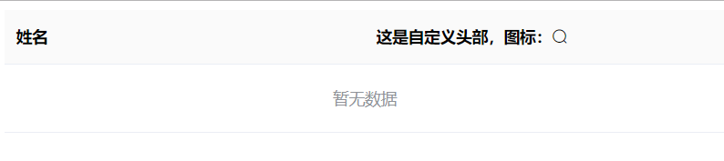
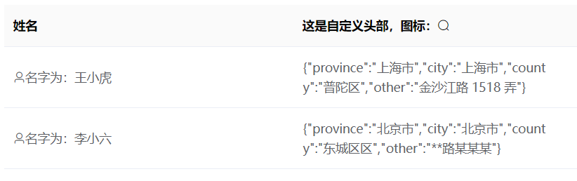
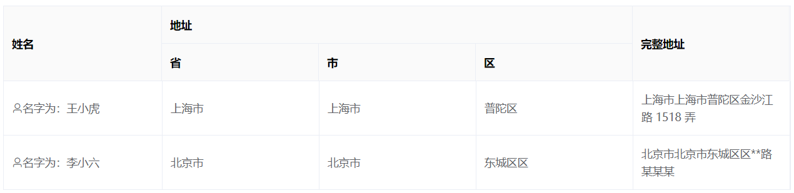

以下为表格组件配置项说明

# 属性
|属性项|说明|类型|可选值|
|---|---|:---:|:---:|
|rowKey|保证每行数据的值唯一性的key，用于优化Table的渲染|string|-|
|selection|是否前置复选框，用于选择|boolean|-|
|data|表格的数据源|array|-|
|spanMethod|合并行或列的计算方法|Function({ row, column, rowIndex, columnIndex })|具体看ElementUI的Table组件项配置说明|
|defaultSort|默认的排序列的 prop 和顺序。它的prop属性指定默认的排序的列，order指定默认排序的顺序|object|具体看ElementUI的Table组件项配置说明|
|config|表格渲染的配置项|array|具体看下表说明|

## config配置属性说明
`config`配置属性是一个数组，用于对整个表格列进行渲染配置，数组中每一项内容为表格的每一列的相关配置（包括表头和内容）。每一项的相关配置如下：

|属性|说明|类型|可选|
|---|---|:---:|:---:|
|label|表头的标题内容|string|-|
|labelTemplateName|表头使用自定义模板渲染，该值为自定义模板的名称，具体使用看下表|string|-|
|prop|在当前列中单元格的字段名称，用于从`data`数据源中根据该字段名称获取值渲染到单元格|string|-|
|propTemplateName|在当前列中单元格使用自定义模板渲染的模板名称，具体使用看下表|string|-|
|formatter|在当前列中单元格的内容都执行该方法，并把方法返回值渲染到单元格|Function(row, column)||
|sortable|当前列的表头是否可点击排序|boolean||
|width|表格该列的宽度|string||
|minWidth|表格该列的最小宽度|string||
|filters|表格的表头是否带筛选框|Array[{ text, value }]||
|filterMethod|筛选是否过滤的方法，如果是多选的筛选项，对每一条数据会执行多次，任意一次返回 true 就会显示。|Function(value, row, column)||
|columns|多级表头的配置，即分成多个子列|array||

> 注意事项
> 1. `labelTemplateName`与`label`都是表头内容的配置项，而`labelTemplateName`项若存在，则会忽略`label`的内容；
> 2. `prop`、`propTemplateName`和`formatter`都是内容单元格的配置项，其优先度为`propTemplateName`>`formatter`>`prop`；
> 3. 设置`sortable`后若点击表头，只会触发`sortChange`事件，不会自动对当前列表进行排序。


### labelTemplateName 自定义表头

#### 代码实例

如下为一个vue文件的编写实例：

```
<template>
  <public-table :config="config">
    <template #addressLabel>
      这是自定义头部，图标：<i class="el-icon-search"></i>
    </template>
  </public-table>
</template>
<script>
export default {
  data(){
    return {
      config: [
      {
        label: '姓名',
        prop: 'name'
      },{
        label: '地址',
        labelTemplateName: 'addressLabel',
        prop: 'address',
      }]
    }
  }
}
</script>
```

可以看到，在配置项中配置了`labelTemplateName`外，还要根据其值在`public-table`内部编写模板`template`，这样表头标题才会显示自定义模板的内容，而非`label`项设置的字符串内容。

#### 实例UI展示：




### propTemplateName 自定义单元格内容

#### 代码实例
```
<template>
  <public-table :config="config" :data="data">
    <template #addressLabel>
      这是自定义头部，图标：<i class="el-icon-search"></i>
    </template>
    <template #nameTpl="{row}">
      <i class="el-icon-user"></i>名字为：{{row.name}}
    </template>
  </public-table>
</template>
<script>
  export default {
    data() {
      return {
        config: [
          {
            label: '姓名',
            prop: 'name',
            propTemplateName: 'nameTpl'
          }, {
            label: '地址',
            labelTemplateName: 'addressLabel',
            prop: 'address',
          }
        ],
        data: [
          {
            "name": "王小虎",
            "address": {
              "province": "上海市",
              "city": "上海市",
              "county": "普陀区",
              "other": "金沙江路 1518 弄"
            },
          }, {
            "name": "李小六",
            "address": {
              "province": "北京市",
              "city": "北京市",
              "county": "东城区区",
              "other": "**路某某某"
            },
          }
        ]
      }
    }
  }
</script>
```

可以看到，其用法与`labelTemplateName`大致相同，但是有个不同点就是，对于`propTemplateName`是每一行数据都会根据模板渲染，结果是共用一个模板，但是每一行展示内容不一致。

关键点在于：

```
#nameTpl="{row}"
```

在模板内部可以通过变量`row`来获取每一行的数据，因此可以渲染出不同内容，除此之外还可以获取数据排序索引`$index`，配置`column`，通过这些变量可以在模板中渲染出自定义内容。

```
#nameTpl="{row,$index,column}"
```

#### UI展示




### columns多级表头

通过`columns`来把当前列分成多级表头，并且根据`columns`的数据项来渲染子列。

若想实现以下UI图




其配置如下：

```
<template>
  <public-table :config="config" :data="data">
    <template #nameTpl="{row}">
      <i class="el-icon-user"></i>名字为：{{row.name}}
    </template>
  </public-table>
</template>
<script>
  export default {
    data() {
      return {
        config: [
          {
            label: '姓名',
            prop: 'name',
            propTemplateName: 'nameTpl'
          }, {
            label: '地址',
            prop: 'address',
            columns: [{
              label: '省',
              prop: 'address.province',
            }, {
              label: "市",
              prop: 'address.city'
            }, {
              label: "区",
              prop: "address.county"
            }]
          }, {
            label: "完整地址",
            prop: "address",
            formatter: (row) => {
              console.log(row)
              const {province, city, county, other} = row.address;
              return province + city + county + other;
            }
          }
        ],
        data: [
          {
            "name": "王小虎",
            "address": {
              "province": "上海市",
              "city": "上海市",
              "county": "普陀区",
              "other": "金沙江路 1518 弄"
            },
          }, {
            "name": "李小六",
            "address": {
              "province": "北京市",
              "city": "北京市",
              "county": "东城区区",
              "other": "**路某某某"
            },
          }
        ]
      }
    }
  }
</script>
```

# 事件
|事件名|说明|参数|
|---|---|---|
|select	|用户手动勾选Checkbox触发，selection表示已选择的，row表示当前选中项|selection, row|
|selectionChange	|Checkbox只要有改变的都触发|selection|
|sortChange	|用户点击表头进行排序时候触发|{column, prop, order}|

其中，`sortChange`中的order的值为降序`descending`,升序`ascending`和不排序`null`

# 组件引用

通过组件引用调用组件内部的`getTableRef`方法，可以获取ElementUI表格组件的引用，通过该引用可以调用ElementUI表格组件提供的[一系列方法](https://element.eleme.io/#/zh-CN/component/table#table-methods)

实例：

```
<template>
  <el-button @click="onClick"></button>
  <public-table ref="pubTable"></public-table>
</template>

<script>
export default {
  method:{
    onClick(){
      const ref = this.$refs['pubTable'].getTableRef();
      ref.toggleAllSelection();
    }
  }
}
</script>

```
